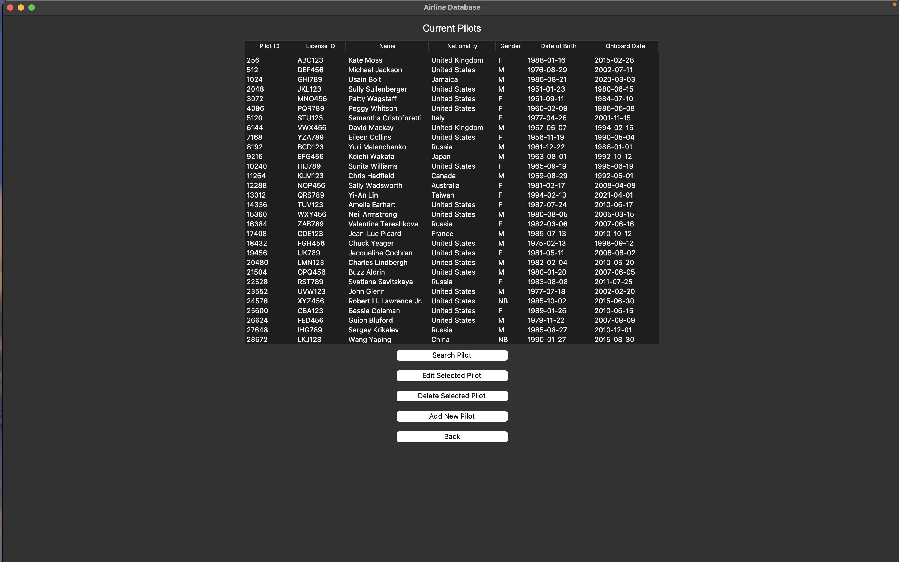
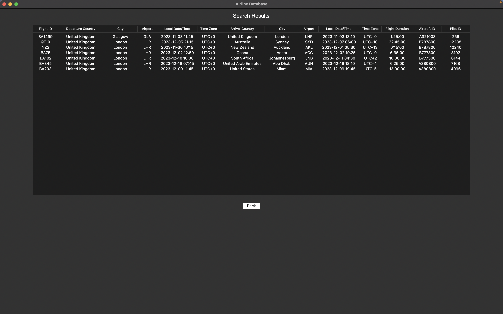

# Airline Database Management System (CRUD)

This is a Python-based application that offers an interactive interface for simulating the management of an airline database using CRUD (Create, Read, Update, Delete) operations. The application features a graphical user interface built with Tkinter, which is seamlessly connected to a Relational Database System (RDS) backend using SQLite.

## Features
### Relational Database System (RDS)
The program sets up an SQLite database with tables for flights, pilots, aircraft, and airports, using keys to relate the data. This structure ensures efficient management, maintains data integrity, and allows for easy updates and queries.

### Graphical User Interface
A user-friendly interface powered by Tkinter allows users to interact with the airline database and visualise information easily.
- Main interface


- Information visualisation and buttons to operate the database




### CRUD Operations
The application supports standard database operations such as adding, viewing, editing, searching and deleting records related to flights, pilots, and aircraft through the GUI.
- Search database



- Add to database


- Select existing data to delete/edit


## How to Run
Before running the Airline DBMS Simulator, ensure that you have **Python 3.11 or above**, as well as the **Tkinter** and **SQLite3** libraries installed on your machine.

### 1. Installation
First, make sure you have Python 3.6 or above installed on your machine. You can check your Python version by running:
```bash
python --version
```
By default, Tkinter and SQLite3 come bundled with Python starting from version 3.1. If you're using a version of Python 3.6 or above, you should already have these libraries installed. However, if for any reason they are missing, you can install them manually using pip.
```bash
pip install tk
```
```bash
pip install pysqlite3
```

### 2. Running the Application
Once you have Python, Tkinter, and SQLite3 installed, you can run the application.

Clone or download this repository, navigate to the project directory, and run the application using:
```bash
python main.py
```
This will start the GUI where you can interact with the airline database.
